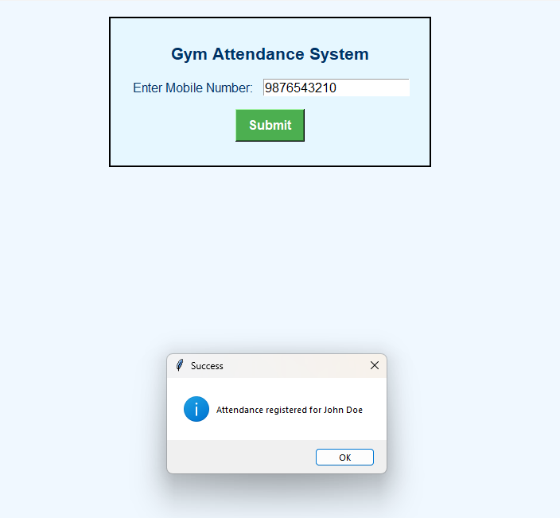

# Gym Attendance System

## Project Description
The **Gym Attendance System** is a simple and user-friendly application designed for gym owners to register and track member attendance. Users can input their mobile numbers, and the system will log the attendance along with the current time. Attendance data is stored in a CSV file, and member information is retrieved from a MySQL database.

## Problem Statement
Tracking gym attendance manually is time-consuming and prone to errors. This system automates the process by allowing gym members to log their attendance via their mobile number. The system checks the database for member information, logs the attendance in a CSV file, and provides real-time feedback to the user.

## Features
- **Attendance Logging**: Members can register their attendance by entering their mobile number.
- **Member Verification**: The system checks the MySQL database to verify if the mobile number is valid.
- **Timestamp Logging**: Attendance is logged with the current date and time in a CSV file.
- **Graphical User Interface (GUI)**: A simple and clean Tkinter-based GUI for ease of use.
- **Error Handling**: The system shows error messages for invalid or unregistered mobile numbers.

## Screenshots

### Main Interface
  
*Figure 1: Main interface of the Gym Attendance System.*

### Attendance Registered
  
*Figure 2: Success message after registering attendance.*
